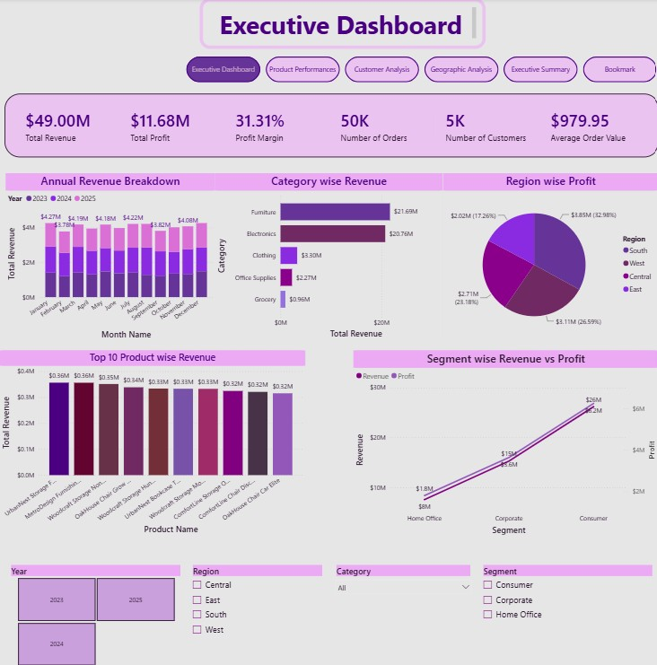
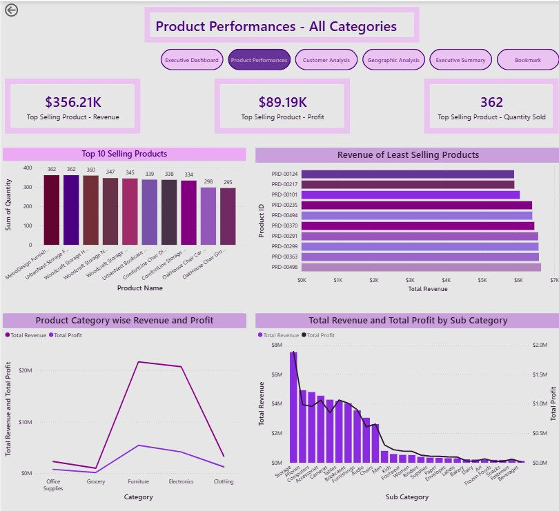
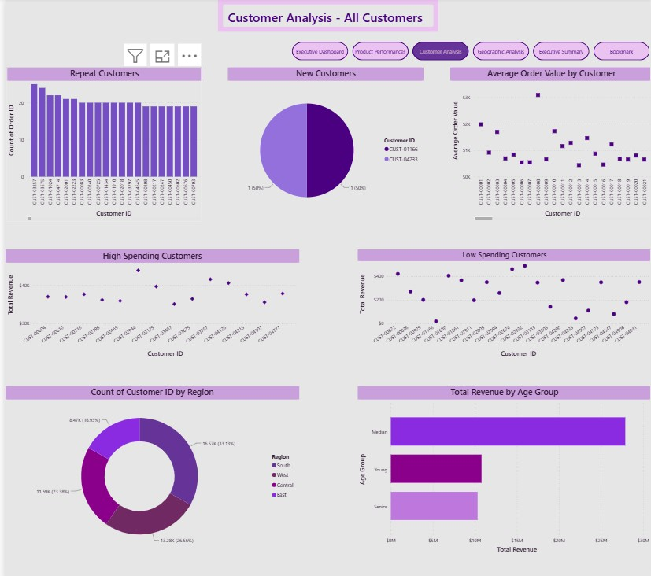
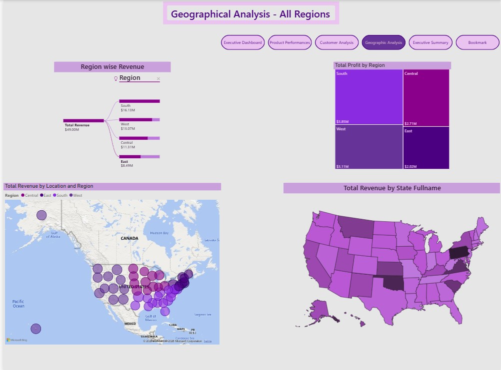

# Retail Sales Analytics Dashboard

An end-to-end Power BI Business Intelligence dashboard that analyzes retail sales, customer behavior, product performance, and regional profitability through interactive visualizations and advanced DAX calculations.

## Project Overview

This project is an end-to-end Business Intelligence solution developed using **Microsoft Power BI**. The dashboard transforms raw retail sales data into meaningful business insights through interactive visualizations, KPIs, drill-through pages, bookmarks, dynamic titles, and conditional formatting.

The objective of this project is to help business managers monitor sales performance, profitability, customer behavior, and regional performance while enabling interactive exploration of the data.

---

## Dashboard Pages

### Executive Dashboard
- Revenue Overview
- Profit Overview
- Profit Margin
- Customer Count
- Order Count
- Revenue by Category
- Revenue by Product
- Regional Profit Analysis
- Annual Revenue Trend

---

### Product Performance
- Top Selling Products
- Product Revenue
- Product Profit
- Product Cost
- Product Margin
- Revenue by Category
- Revenue Distribution

---

### Customer Analysis
- Customer Revenue
- Customer Profitability
- Customer Segmentation
- Customer Purchasing Behaviour

---

### Geographic Analysis
- Region-wise Revenue
- Region-wise Profit
- Interactive Regional Analysis

---

### Executive Summary
- Detailed Transaction Table
- Drill-through Navigation
- Interactive Summary Report

---

## Features

- Interactive Dashboard Navigation
- Dynamic Titles
- Bookmarks
- Drill-through Pages
- Report Tooltips
- Conditional Formatting
- KPI Cards
- Slicers
- Sync Slicers
- Page Navigation Buttons

---

## Power BI Skills Demonstrated

- Power Query
- Data Cleaning
- Data Transformation
- Data Modeling
- Relationship Management
- DAX Measures
- Time Intelligence
- Conditional Formatting
- Interactive Reporting
- Dashboard Design
- Bookmarks
- Drill-through
- Tooltips

---

## Technologies Used

- Microsoft Power BI Desktop
- Power Query
- DAX
- Microsoft Excel
- Data Modeling
- Git & GitHub
---

## Dashboard Preview

### Executive Dashboard

### Product Performance

### Customer Analysis

### Geographic Analysis

### Executive Summary

 
---

## Dataset

Synthetic Retail Sales Dataset used for learning and portfolio development.

---

## Project Summary

- Dashboard Pages: 5
- Dataset Size: 50,000 Orders
- KPIs: Revenue, Profit, Margin, Orders, Customers
- DAX Measures: 30+
- Interactive Features:
  - Drill-through
  - Tooltips
  - Bookmarks
  - Dynamic Titles
  - Sync Slicers
  - Conditional Formatting

## Author

**Nishan Harsha Maduranga**

GitHub:
[https://github.com/nishanhm86](https://github.com/nishanhm86)

---

## Project Status

Completed

This dashboard demonstrates practical Business Intelligence techniques including data modeling, DAX, interactive reporting, bookmarks, drill-through, tooltips, and dashboard design using Microsoft Power BI.

## Future Improvements

- Add Top 10 Customers analysis
- Add Highest Revenue Month KPI
- Add Lowest Revenue Month KPI
- Add Customer Lifetime Value analysis
- Publish dashboard to Power BI Service

## DAX Concepts Used

### Aggregation
- SUM()
- AVERAGE()
- COUNT()
- DISTINCTCOUNT()

### Filter Context
- CALCULATE()
- FILTER()
- ALLSELECTED()
- ALLEXCEPT()

### Time Intelligence
- TOTALYTD()
- SAMEPERIODLASTYEAR()

### Logical Functions
- IF()

### Mathematical Functions
- DIVIDE()
- MAX()
- MIN()

### Text Functions
- FORMAT()

### Dynamic Reporting
- SELECTEDVALUE()

### Variables
- VAR
- RETURN

## License

This project is licensed under the MIT License.
